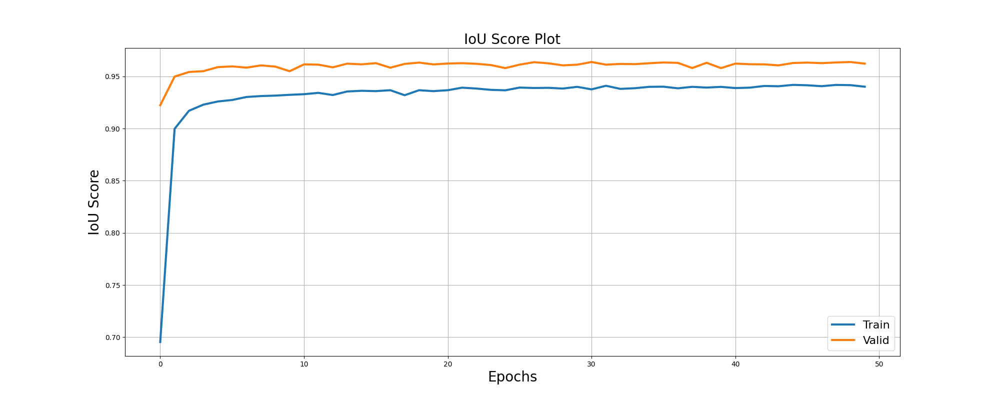
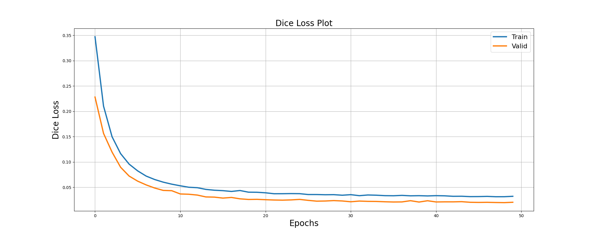
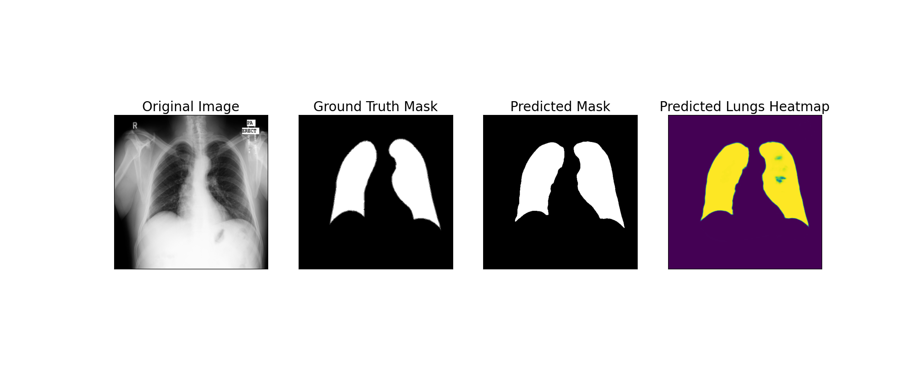
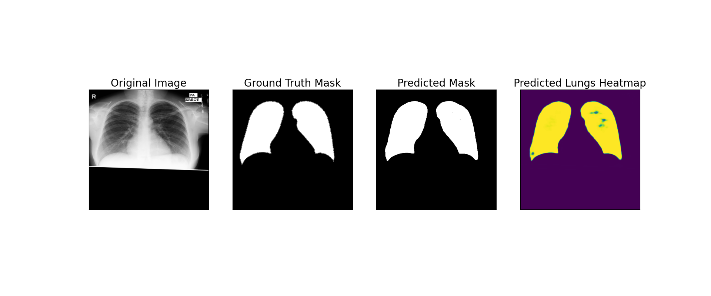

# Lung Segmentation in chest X-ray images

X-ray is one of the most commonly used diagnostic technology as it is widely available, low cost, non-invasive, and easy to acquire. Chest radiography is the most popular and important imaging modality used to diagnose various pulmonary diseases. The automatic segmentation of the lung region from chest X-ray (CXR) can help doctors diagnose many lung diseases.

## Installation

This code was developed with Python 3.10.12 on Linux Mint 21.3. Python requirements can installed by:

```bash
pip install -r requirements.txt
```
## Datasets
The [Chest Xray](https://www.kaggle.com/datasets/nikhilpandey360/chest-xray-masks-and-labels/code) dataset is used for this task. All images are resized to 512*512 and samples of the data are in the assets folder.


## Models
The [segmentation_models_pytorch](https://github.com/qubvel/segmentation_models.pytorch) library is used to create the segmentation model which is defined in `model.py` file. 

## Traing and Inference

The `train.py` is used to train the model. Pretrained model run for 50 epoch is saved in assets folder. The `inference.py` is used to test the model on the test dataset.



## Results

